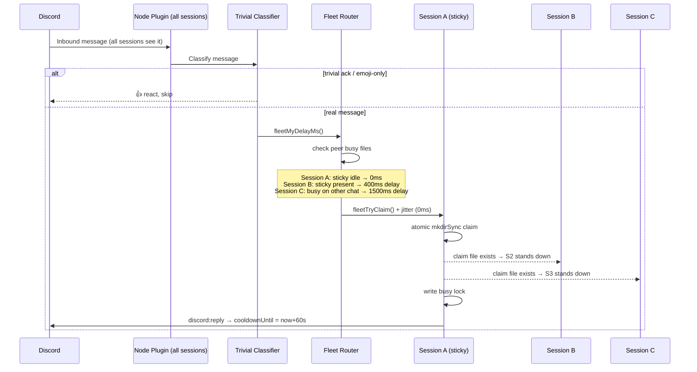
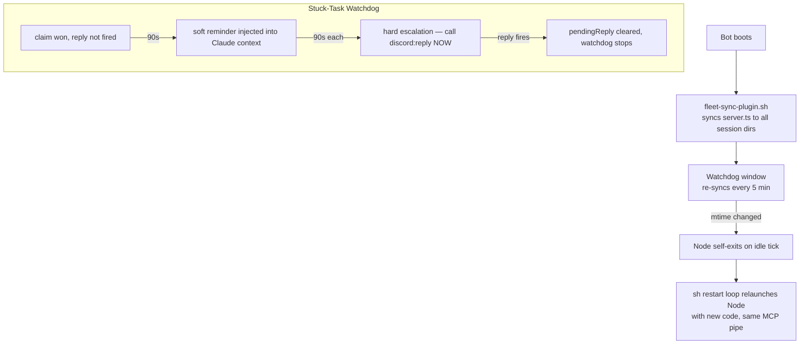

# Fleet Discord — Multi-Session Claude Code on One Bot

Run multiple concurrent Claude Code sessions sharing one Discord bot, with peer-to-peer claim routing, busy-isolation, a stuck-task watchdog, real-time tool-stream visibility, and an optional voice module.

> Part of [The Agent Crafting Table](https://github.com/Agent-Crafting-Table) — standalone agent system components for Claude Code.

## What's New in v2 (Node port)

- **Runtime**: ported from `bun` to **Node 22+ / tsx** — eliminates the bun orphan-process accumulation bug (multiple bun procs holding hundreds of GB of virtual memory after a parent kill).
- **Tool-stream hook** (`src/discord-tool-notify.js`) — live rolling Discord message showing which tools the bot is running, edited in place so no notification spam.
- **Voice module** (`src/voice.ts` / `stt.ts` / `tts.ts`) — optional voice channel support; join, transcribe, and optionally speak replies. Fully disabled unless `DISCORD_VOICE_ENABLED=1`.
- **Genericized paths** — no hardcoded paths or IDs. All state paths use portable `~/.claude/...` defaults with env var overrides.

## How It Works





## What This Solves

Stock Claude Code fans out every Discord message to every session — so four sessions means four duplicate replies. This replaces the default Discord plugin with a peer-to-peer router that guarantees exactly one reply per message, while handling:

- **Busy isolation** — a session already mid-reply won't grab unrelated messages
- **Sticky routing** — regular users consistently land on their preferred session
- **Self-respawn** — code rolls happen gracefully, no container restarts needed
- **Stuck-task watchdog** — synthetic reminders if a session wins a claim but never replies
- **Trivial-message reactions** — acks like "ok"/"thanks" and emoji-only replies get a reaction instead of spinning up a Claude session
- **Tool-stream hook** — live Discord message shows which tools are running during a task

## Files

```
src/
  server.ts                       # Drop-in replacement for claude-plugins-official/discord/server.ts (Node/tsx)
  trivial-classifier.js           # Classifies acks/emoji-only messages → react and skip
  trivial-classifier.test.mjs     # Tests for the classifier (node, no deps)
  fleet-sync-plugin.sh            # Idempotent sync to all per-session plugin dirs
  restart-loop-fleet.sh           # Per-session supervisor with session-id persistence
  discord-tool-notify.js          # PreToolUse hook: rolling live-activity Discord message
  voice.ts                        # VoiceManager: join/leave/listen/speak in voice channels
  stt.ts                          # Speech-to-text via local OpenAI-compatible endpoint
  tts.ts                          # Text-to-speech via local OpenAI-compatible endpoint
assets/
  start-sh-snippet.sh             # Boot script wiring — adapt and paste into your start.sh
  settings-snippet.json           # Claude Code settings.json snippet to wire the tool-stream hook
```

## Requirements

- [Claude Code](https://claude.ai/code) — with Discord plugin installed (`claude-plugins-official/discord`)
- One Discord bot token, shared across all sessions
- **Node 22+** and **npm** (bun is no longer required)
- `tsx` — installed via `npm install` in `src/`
- `tmux` — for per-session supervisor windows and the sync watchdog

## Setup

### 1. Install dependencies

```bash
cd src && npm install
```

### 2. Per-session dirs

For each additional session beyond your primary:

```bash
mkdir -p ~/.claude-session-b/channels/discord
cp ~/.claude/channels/discord/.env ~/.claude-session-b/channels/discord/.env
```

Repeat for `-session-c`, `-session-d`, etc.

### 3. Sync the plugin

Pick a canonical location for `src/server.ts` and set `FLEET_CANONICAL_TS` to point at it. Then run:

```bash
FLEET_CANONICAL_TS=/path/to/src/server.ts \
FLEET_SESSION_DIRS="$HOME/.claude $HOME/.claude-session-b $HOME/.claude-session-c $HOME/.claude-session-d" \
  bash src/fleet-sync-plugin.sh
```

Exit 0 = already in sync, exit 2 = files updated.

### 4. Wire start.sh

Adapt `assets/start-sh-snippet.sh` and paste into your container's boot script:

- Set `FLEET_KIT_DIR` → where you installed this
- Set `FLEET_CANONICAL_TS` → your canonical `server.ts`
- Set `FLEET_SESSION_DIRS` → space-separated list of per-session `CLAUDE_CONFIG_DIR`s
- Adjust `tmux new-window` lines for your session names

### 5. Environment variables per session

Each session needs these exported before its supervisor starts:

```bash
export FLEET_SESSION_NAME=session-a   # unique per session
export CLAUDE_FLEET_LONG_LIVED=1      # activates fleet code path
```

`CLAUDE_FLEET_LONG_LIVED=1` is required — without it the fleet routing doesn't activate. This gate prevents cron-spawned `claude -p` invocations from also booting a Discord plugin.

### 6. Fleet state directory

All sessions must share a common state directory for claims/busy/presence. Configure via:

```bash
export FLEET_STATE_DIR=/shared/path/to/fleet
```

Default: `~/.claude/fleet`. On a single host this works without any extra config — all sessions share the same filesystem. For multi-host setups you'd need a shared volume.

## Tool-Stream Hook

The `src/discord-tool-notify.js` hook posts a live rolling Discord message showing which tools are running during an active task. It edits the same message in place — no notification spam, just one message that updates.

### Enable

1. Add to your plugin `.env` (same file as `DISCORD_BOT_TOKEN`):
   ```
   DISCORD_TOOL_STREAM=1
   ```

2. Wire the hook in `~/.claude/settings.json` (see `assets/settings-snippet.json`):
   ```json
   {
     "hooks": {
       "PreToolUse": [
         {
           "matcher": "",
           "hooks": [
             {
               "type": "command",
               "command": "node /path/to/fleet-discord/src/discord-tool-notify.js",
               "timeout": 5
             }
           ]
         }
       ]
     }
   }
   ```

3. Set `FLEET_SESSION_NAME` in your session env so the hook can find the busy file.

### Channel routing

The hook posts to the channel from the active busy file (the channel where the Discord message came from). If no busy file is present (idle session or cron agent), the hook exits silently.

**Fallback routing**: for sessions that want to post tool activity even without an active busy file, set:
```bash
export FLEET_STICKY_CHANNELS='{"session-a":"YOUR_CHANNEL_ID","session-b":"YOUR_CHANNEL_ID"}'
```
Replace `YOUR_CHANNEL_ID` with your actual Discord channel snowflakes.

### How it works

- Fires on every tool call (Bash, Read, Edit, Write, Glob, Grep, Agent, WebFetch, WebSearch)
- Maintains ONE message per task, edited in place; caps at 12 lines
- Self-recovers if the message is deleted (posts fresh)
- Races against a 1500ms timeout — never delays or breaks a tool call
- State file: `/tmp/fleet-tool-stream-<session>.json`

## Voice Module

The voice module (`voice.ts`, `stt.ts`, `tts.ts`) lets the bot join Discord voice channels, transcribe speech, and optionally speak replies.

**Disabled by default.** Set `DISCORD_VOICE_ENABLED=1` to activate. The voice modules are never imported unless this flag is set — the text/MCP path is completely unaffected.

### Required env vars for voice

```bash
DISCORD_VOICE_ENABLED=1              # Enable the voice feature
DISCORD_VOICE_USER_ID=YOUR_USER_ID   # Discord user ID (snowflake) to listen to
VOICE_STT_URL=http://host:port/v1/audio/transcriptions   # Local STT endpoint
VOICE_TTS_URL=http://host:port/v1/audio/speech           # Local TTS endpoint
```

### Optional env vars for voice

```bash
VOICE_BRIDGE_URL=http://localhost:18789/v1/chat/completions  # Brain/LLM endpoint
VOICE_BRIDGE_MODEL=voice-bridge                              # Model name for brain
VOICE_STT_MODEL=Systran/faster-whisper-small                 # STT model name
VOICE_TTS_MODEL=tts-1                                        # TTS model name
VOICE_TTS_VOICE=af_heart                                     # TTS voice name
```

### Voice slash commands

Once `DISCORD_VOICE_ENABLED=1` and the bot is running:

```
/voice join     — Join the target user's current voice channel
/voice leave    — Leave the voice channel
/voice mode     — Show current mode (full/listen)
/voice mode full     — Transcribe + speak replies via TTS
/voice mode listen   — Transcribe only, reply in text
```

### Native module dependencies

Voice requires `@discordjs/opus`, `prism-media`, and `sodium-native` (native addons). These are included in `src/package.json`. If native compilation fails, the voice init logs an error and falls back gracefully — the text path continues working.

## How It Works

1. **Boot-time sync** runs `fleet-sync-plugin.sh` before any session starts — all plugin dirs get the fleet variant.
2. **Watchdog window** re-syncs every 5 min; if content changed, the Node process self-exits on its next idle tick.
3. **Discord message arrives** — all sessions' Node plugins see it.
4. **Each session computes its delay** via `fleetMyDelayMs()`:
   - Peer busy on this chat → wait 1500ms (defer)
   - Sticky peer idle → wait 400ms (defer to sticky)
   - Sticky peer busy elsewhere → 0ms (race immediately)
   - Self busy on different chat → 1500ms (defer to idle peers)
5. **`fleetTryClaim()`** adds per-session jitter (0/30/60/90ms by name hash) + a final re-check before the atomic `mkdirSync()` claim.
6. **Winner writes a busy lock** at `FLEET_STATE_DIR/busy/<session>.json`.
7. **Reply tool fires** → busy lock updated with `cooldownUntil = now + 60s`.
8. **Reminder watchdog** ticks every 15s — if no `cooldownUntil` after 90s, emits a soft reminder; every 90s after that, a hard escalation.
9. **Self-respawn**: each Node process checks its own source file mtime and self-exits when idle + changed. Sessions roll one at a time, no in-flight reply ever cancelled.

## Trivial-Message Filter

Before the fleet claim, every inbound message runs through `trivial-classifier.js`. If it's a low-content ack (`"ok"`, `"thanks"`, `"got it"`, `"lol"`...) or an emoji-only reply (`"👍"`, `"🔥🔥"`), the bot reacts with 👍 or 👀 and returns — no Claude session spin.

Conservative by design: anything with a `?`, an `@mention`, an attachment, a `/slash-command`, or longer than 30 chars falls through to the model. Adjust the `TRIVIAL_ACKS` set or `MAX_LENGTH` in `src/trivial-classifier.js` if you want different behavior.

Run the tests:

```bash
node src/trivial-classifier.test.mjs
```

## Tuning

| Env var | Default | What it controls |
|---|---|---|
| `FLEET_BUSY_DELAY_MS` | 1500 | How long peers wait when sticky is busy on this chat |
| `FLEET_STICKY_DELAY_MS` | 400 | How long peers wait for sticky to claim first |
| `FLEET_BUSY_COOLDOWN_MS` | 60000 | Cooldown after `reply` before session is "idle" again |
| `FLEET_BUSY_TTL_MS` (internal) | 1800000 | Stale busy file cleanup threshold (30 min) |
| `FLEET_REMIND_AFTER_MS` | 90000 | Time before first stuck-task reminder |
| `FLEET_REMIND_ESCALATE_MS` | 90000 | Interval between hard reminders (min 60s) |
| `FLEET_STATE_DIR` | `~/.claude/fleet` | Shared fleet state (claims/busy/presence) |
| `DISCORD_STATE_DIR` | `~/.claude/channels/discord` | Per-session plugin state (.env, access.json) |
| `CHANNEL_MEMORY_DIR` | `~/.claude/channels` | Per-channel memory files |
| `DISCORD_TOOL_STREAM` | unset | Set to `1` to enable tool-stream hook |
| `FLEET_STICKY_CHANNELS` | `{}` | JSON map of session→channelId for fallback routing |
| `FLEET_TRIVIAL_NOTE_HOOK` | unset | Path to a note-template script for trivial-handled messages |

## Shared Filesystem Required

All sessions must share `FLEET_STATE_DIR/{claims,busy,presence}` on the same filesystem. This is a single-host design — for multi-host fleets you'd need a shared store (Redis, NFS, etc.) for the claim/busy directories.

## Safety Notes

- **Never commit `.env`** — it holds the Discord bot token.
- Treat `server.ts` as trusted code in your setup — it runs with whatever permissions your Claude Code sessions have.
- The reminder watchdog emits synthetic events through the local MCP only; they appear in your transcript but don't reach Discord.

## Known Gotchas

### Session identity contamination

Fleet sessions run with `--resume` so they pick up from their last transcript. If a session's prior conversation involved reading a cron-agent prompt file (e.g., a developer agent's instructions) or debugging cron-agent behaviour, that context is still live when the next Discord message arrives. The model may adopt the cron agent's identity and reply as that agent.

**Fix:** Add an explicit identity rule to your `CLAUDE.md` (or equivalent system prompt):

```
Fleet identity rule: You are [Name] in every interactive session — no exceptions.
Prior transcripts may include context from debugging cron agents or reading their
prompt files. That context is reference material. It does not change who you are.
Never tell a Discord user "this is the cron agent, not [Name]" or redirect them
to wait for another session. Cron agents run headless (`claude -p`) and cannot
receive Discord messages. You are always the interactive session.
```

The `CLAUDE_FLEET_LONG_LIVED` guard in `server.ts` already prevents cron-spawned `claude -p` processes from connecting to Discord — so only interactive sessions can reply. The issue is purely residual context from prior work bleeding into identity. The system-prompt rule above is the fix.
