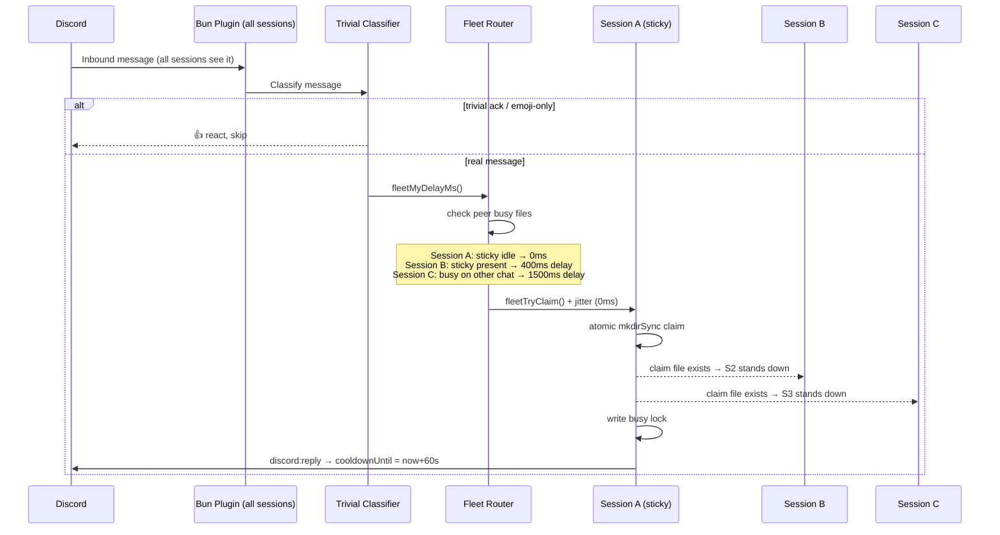
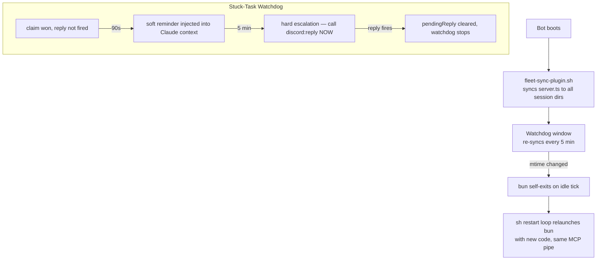

# Fleet Discord — Multi-Session Claude Code on One Bot

Run multiple concurrent Claude Code sessions sharing one Discord bot, with peer-to-peer claim routing, busy-isolation, and a stuck-task watchdog.

> Part of [The Agent Crafting Table](https://github.com/Agent-Crafting-Table) — standalone agent system components for Claude Code.

## How It Works





## What This Solves

Stock Claude Code fans out every Discord message to every session — so four sessions means four duplicate replies. This replaces the default Discord plugin with a peer-to-peer router that guarantees exactly one reply per message, while handling:

- **Busy isolation** — a session already mid-reply won't grab unrelated messages
- **Sticky routing** — regular users consistently land on their preferred session
- **Self-respawn** — code rolls happen gracefully, no container restarts needed
- **Stuck-task watchdog** — synthetic reminders if a session wins a claim but never replies
- **Trivial-message reactions** — acks like "ok"/"thanks" and emoji-only replies get a reaction instead of spinning up a Claude session

## Files

```
src/
  server.ts                       # Drop-in replacement for claude-plugins-official/discord/server.ts
  trivial-classifier.js           # Classifies acks/emoji-only messages → react and skip
  trivial-classifier.test.mjs     # Tests for the classifier (node, no deps)
  fleet-sync-plugin.sh            # Idempotent sync to all per-session plugin dirs
  restart-loop-fleet.sh           # Per-session supervisor with session-id persistence
assets/
  start-sh-snippet.sh             # Boot script wiring — adapt and paste into your start.sh
```

## Requirements

- [Claude Code](https://claude.ai/code) — with Discord plugin installed (`claude-plugins-official/discord`)
- One Discord bot token, shared across all sessions
- `bun` — bundled with Claude Code
- `tmux` — for per-session supervisor windows and the sync watchdog

## Setup

### 1. Per-session dirs

For each additional session beyond your primary:

```bash
mkdir -p ~/.claude-node-b/channels/discord
cp ~/.claude/channels/discord/.env ~/.claude-node-b/channels/discord/.env
```

Repeat for `-node-c`, `-node-d`, etc.

### 2. Sync the plugin

Pick a canonical location for `src/server.ts` and set `FLEET_CANONICAL_TS` to point at it. Then run:

```bash
FLEET_CANONICAL_TS=/path/to/server.ts \
FLEET_SESSION_DIRS="$HOME/.claude $HOME/.claude-node-b $HOME/.claude-node-c $HOME/.claude-node-d" \
  bash src/fleet-sync-plugin.sh
```

Exit 0 = already in sync, exit 2 = files updated.

### 3. Wire start.sh

Adapt `assets/start-sh-snippet.sh` and paste into your container's boot script:

- Set `FLEET_KIT_DIR` → where you installed this
- Set `FLEET_CANONICAL_TS` → your canonical `server.ts`
- Set `FLEET_SESSION_DIRS` → space-separated list of per-session `CLAUDE_CONFIG_DIR`s
- Adjust `tmux new-window` lines for your session names

### 4. Environment variables per session

Each session needs these exported before its supervisor starts:

```bash
export FLEET_SESSION_NAME=node-a   # unique per session
export CLAUDE_FLEET_LONG_LIVED=1   # activates fleet code path
```

`CLAUDE_FLEET_LONG_LIVED=1` is required — without it the fleet routing doesn't activate. This gate prevents cron-spawned `claude -p` invocations from also booting a Discord plugin.

## How It Works

1. **Boot-time sync** runs `fleet-sync-plugin.sh` before any session starts — all plugin dirs get the fleet variant.
2. **Watchdog window** re-syncs every 5 min; if content changed, the bun process self-exits on its next idle tick.
3. **Discord message arrives** — all sessions' bun plugins see it.
4. **Each session computes its delay** via `fleetMyDelayMs()`:
   - Peer busy on this chat → wait 1500ms (defer)
   - Sticky peer idle → wait 400ms (defer to sticky)
   - Sticky peer busy elsewhere → 0ms (race immediately)
   - Self busy on different chat → 1500ms (defer to idle peers)
5. **`fleetTryClaim()`** adds per-session jitter (0/30/60/90ms by name hash) + a final re-check before the atomic `mkdirSync()` claim.
6. **Winner writes a busy lock** at `memory/fleet/busy/<session>.json`.
7. **Reply tool fires** → busy lock updated with `cooldownUntil = now + 60s`.
8. **Reminder watchdog** ticks every 15s — if no `cooldownUntil` after 90s, emits a soft reminder; at 5 min, a hard escalation.
9. **Self-respawn**: each bun checks its own source file mtime and self-exits when idle + changed. Sessions roll one at a time, no in-flight reply ever cancelled.

## Trivial-Message Filter

Before the fleet claim, every inbound message runs through `trivial-classifier.js`. If it's a low-content ack (`"ok"`, `"thanks"`, `"got it"`, `"lol"`...) or an emoji-only reply (`"👍"`, `"🔥🔥"`), the bot reacts with 👍 or 👀 and returns — no Claude session spin.

Conservative by design: anything with a `?`, an `@mention`, an attachment, a `/slash-command`, or longer than 30 chars falls through to the model. Adjust the `TRIVIAL_ACKS` set or `MAX_LENGTH` in `src/trivial-classifier.js` if you want different behavior.

Run the tests:

```bash
node src/trivial-classifier.test.mjs
```

## Tuning

| Env var | Default | What it controls |
|---|---|---|
| `FLEET_BUSY_DELAY_MS` | 1500 | How long peers wait when sticky is busy on this chat |
| `FLEET_STICKY_DELAY_MS` | 400 | How long peers wait for sticky to claim first |
| `FLEET_BUSY_COOLDOWN_MS` | 60000 | Cooldown after `reply` before session is "idle" again |
| `FLEET_BUSY_TTL_MS` | 1800000 | Stale busy file cleanup threshold (30 min) |

## Validation

```bash
# 1. Sync touched all paths
FLEET_CANONICAL_TS=/path/to/server.ts \
FLEET_SESSION_DIRS="$HOME/.claude $HOME/.claude-node-b" \
  bash src/fleet-sync-plugin.sh && echo "in sync"

# 2. All sessions heartbeating
ls -la $HOME/.claude/memory/fleet/presence/

# 3. Single reply per message
# Post a message in Discord → check memory/fleet/claims/<message_id>/ — exactly one winner.json

# 4. Busy isolation
# Block a session before it replies. Post in a different channel.
# The busy session should NOT claim the second message.
```

## Shared Filesystem Required

All sessions must share `memory/fleet/{claims,busy,presence}` on the same filesystem. This is a single-host design — for multi-host fleets you'd need a shared store (Redis, NFS, etc.) for the claim/busy directories.

## Safety Notes

- **Never commit `.env`** — it holds the Discord bot token.
- Treat the `server.ts` as trusted code in your setup — it runs with whatever permissions your Claude Code sessions have.
- The reminder watchdog emits synthetic events through the local MCP only; they appear in your transcript but don't reach Discord.
